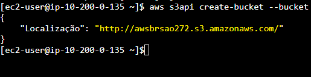
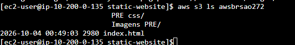
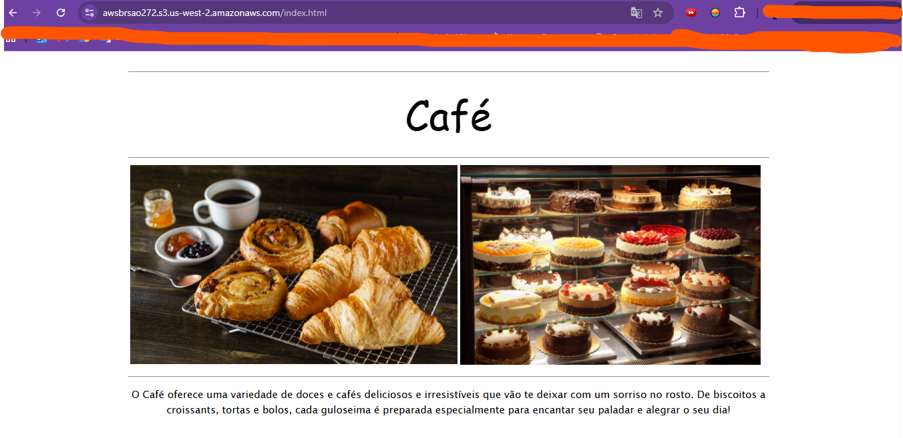

<div align="center">

# 🌐 Lab 170 — Criar um Site no Amazon S3


</div>

---

## 📌 Sobre o laboratório

Neste laboratório, pratiquei o uso de comandos da **AWS Command Line Interface (AWS CLI)**, a partir de uma instância **Amazon EC2**, para criar e publicar um **site estático** hospedado no **Amazon S3**.

> 💡 **Cenário:** hospedar o site de uma cafeteria e padaria fictícia (**Café**) inteiramente via linha de comando — do bucket à publicação — e criar um script reutilizável para futuras atualizações do site.

---

## 🎯 Objetivos

Ao concluir este laboratório, fui capaz de:

- 🖥️ Executar comandos da AWS CLI que usam os serviços do **IAM** e do **Amazon S3**
- 🌐 Implantar um **site estático** em um bucket do S3
- 📜 Criar um **script** que usa a AWS CLI para copiar arquivos de um diretório local para o Amazon S3

---

## 🗺️ Fluxo do laboratório

```
  🔑 Session Manager (SSM)
         │
         ▼
  🖥️  EC2 (Amazon Linux — AWS CLI pré-instalada)
         │
         ├──► 1️⃣ aws s3api create-bucket
         │        🪣  Bucket S3 criado
         │
         ├──► 2️⃣ aws iam create-user
         │        👤  Novo usuário IAM com acesso total ao S3
         │
         ├──► 3️⃣ Ajuste de permissões do bucket
         │        🔓  Acesso público de leitura liberado
         │
         ├──► 4️⃣ unzip static-website.zip
         │        📂  Arquivos do site extraídos
         │
         ├──► 5️⃣ aws s3 cp --recursive
         │        ⬆️  Upload dos arquivos para o S3
         │
         └──► 6️⃣ Script .sh / arquivo em lote
                  🔁  Atualização do site tornada repetível

                        ▼
              🌍  Site "Café" no ar via S3!
```

---

## 🛠️ Etapas realizadas

### ✅ Tarefa 1 — Conectar-se a uma instância do Amazon Linux EC2 usando SSM

Conexão com a instância EC2 realizada via **Session Manager**, do AWS Systems Manager — sem necessidade de chaves SSH ou portas abertas.

### ✅ Tarefa 2 — Configurar a AWS CLI

Diferentemente de outras distribuições Linux, a instância **Amazon Linux** já vem com a **AWS CLI pré-instalada**, simplificando esta etapa.

### ✅ Tarefa 3 — Criar um bucket do S3 usando a AWS CLI

Criação de um bucket S3 usando o comando `s3api`:

```bash
aws s3api create-bucket --bucket awsbrsao272
```



### ✅ Tarefa 4 — Criar um usuário do IAM com acesso total ao Amazon S3

Criação de um novo usuário IAM dedicado, com permissão de **acesso total ao S3**:

```bash
aws iam create-user --user-name <nome-do-usuario>
```

### ✅ Tarefa 5 — Ajustar permissões de bucket do S3

Configuração das permissões do bucket para permitir o **acesso público de leitura**, necessário para que o site pudesse ser acessado por qualquer visitante.

### ✅ Tarefa 6 — Extrair os arquivos necessários para este laboratório

Extração do arquivo compactado contendo todo o conteúdo do site estático (`static-website`), preparando os arquivos para o upload.

### ✅ Tarefa 7 — Fazer upload de arquivos para o Amazon S3 usando a AWS CLI

Upload de todos os arquivos extraídos para o bucket S3:

```bash
aws s3 cp . s3://awsbrsao272/ --recursive
```



### ✅ Tarefa 8 — Criar um arquivo em lote para tornar a atualização do site repetível

Criação de um **script em lote**, editado via **VI**, para automatizar futuras atualizações do site — bastando executá-lo sempre que os arquivos locais forem alterados.

---

## ✅ Resultado final

Site estático da cafeteria **"Café"** publicado com sucesso no Amazon S3, acessível publicamente em `awsbrsao272.s3.us-west-2.amazonaws.com/index.html`, exibindo produtos como croissants, pães e bolos. 🎉☕


---

## 🧠 Principais aprendizados

- 🔹 Como provisionar e publicar um **site estático** inteiramente via linha de comando
- 🔹 Diferença entre criar um bucket (`s3api`) e **fazer upload de conteúdo** (`s3 cp`)
- 🔹 Criação de **usuários IAM com permissões específicas** via CLI
- 🔹 Ajuste de **permissões públicas** em buckets S3 para hospedagem de sites
- 🔹 Automação de tarefas repetitivas com **scripts em lote**
- 🔹 Vantagens do **Session Manager** para acesso seguro, sem SSH

---

## 🏷️ Tecnologias e Serviços


---

<div align="center">

📚 *Laboratório prático realizado como parte da trilha de estudos em Computação em Nuvem, com foco em transição de carreira para Engenharia de Dados.*

</div>
